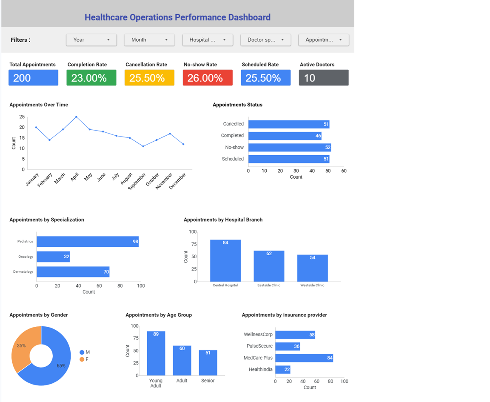
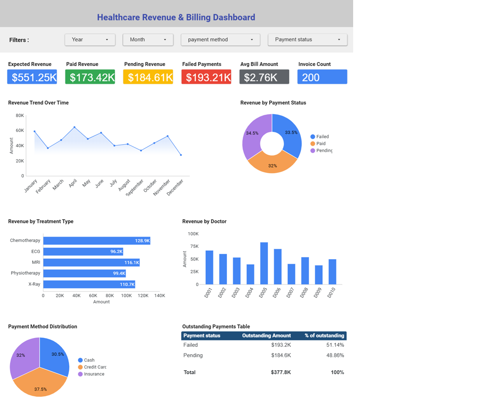
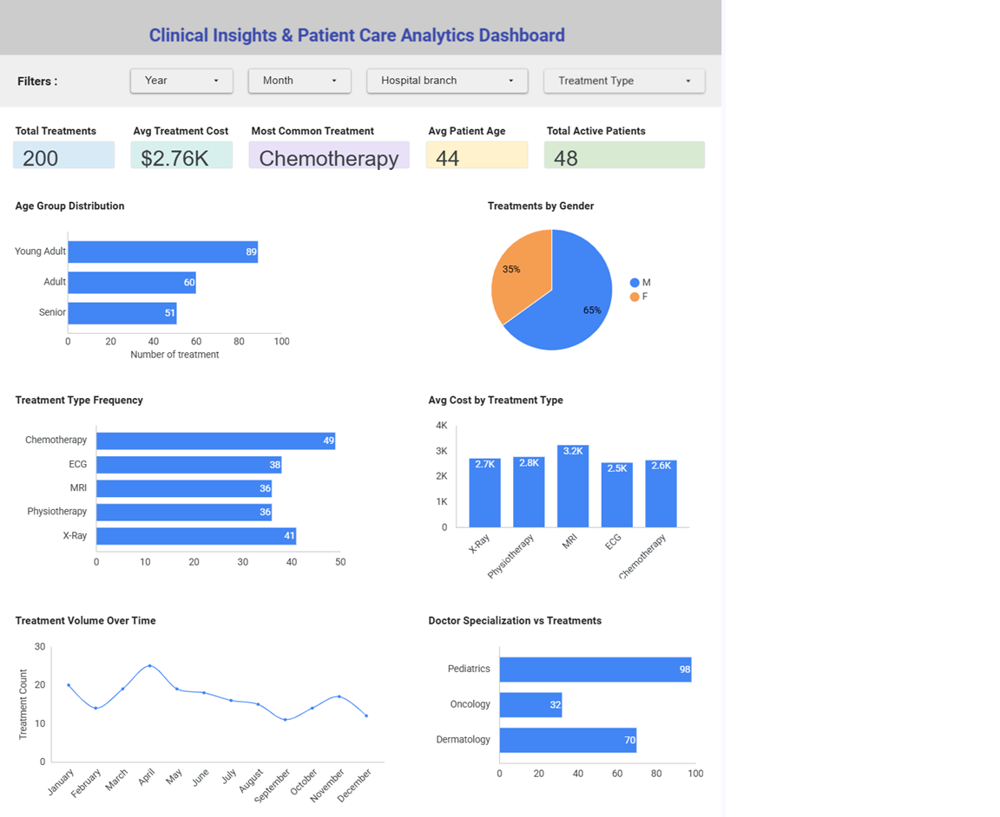

# Healthcare Operations, Finance, and Clinical Analytics

## Project Overview

This project analyzes an integrated healthcare management system across three critical pillars: operational efficiency, financial performance, and clinical patient care. Using a comprehensive relational database, the project implements an advanced data engineering and business intelligence workflow to solve tracking silos, manage revenue leaks, and optimize resource allocation.

The project delivers a centralized, multi-page Looker Studio application designed to provide insights into:
- **Page 1: Operations:** Appointment scheduling lifecycles, cancellation behaviors, and facility utilization by branch.
- **Page 2: Finance:** Revenue collection pipelines, outstanding debt distribution, and transaction method preferences.
- **Page 3: Clinical:** Patient therapeutic throughput, diagnostic volume frequencies, and provider workload distribution.

This project demonstrates a complete multi-dimensional analytics workflow including:
- Multi-table relational data modeling
- Advanced Extract, Transform, Load (ETL) engineering via Power Query
- Feature engineering (dynamic age group categorization and cohort segmentation)
- Cross-departmental business intelligence delivery
- Multi-page interactive dashboard application deployment

---

## 📊 Live Interactive Dashboard

You can interact with the live multi-page dashboard application here:  
👉 **[View the Live Looker Studio Report](https://datastudio.google.com/reporting/ea457737-8c0e-44bf-906a-a616974ab01f)** 

---

## Dashboard Preview

The live Looker Studio report is organized into three specialized pages for seamless navigation:

### Page 1: Healthcare Operations Performance Dashboard


### Page 2: Healthcare Revenue & Billing Dashboard


### Page 3: Clinical Insights & Patient Care Dashboard


---

## Tools & Skills Used

### Tools
- Google Looker Studio (Data Visualization & Cloud BI Reporting)
- Microsoft Excel & Power Query (M-Engine) (ETL & Data Pipeline Engineering)
- Mermaid.live (Relational Data Modeling)

### Skills Demonstrated
- Advanced Data Preparation & Joining (Left Outer Merges)
- Relational Database Normalization Concepts
- Conditional Column Feature Engineering
- Enterprise KPI Design & Aggregation Matrix
- Cross-Functional Analytical Reporting
- Dynamic Filtering Interface Architecture

---

## Data Cleaning & Preparation

The source data consisted of five distinct relational tables containing inconsistent data types, raw date configurations, and unjoined entity keys. 

The following cleaning and engineering steps were performed using Excel and Power Query:
- **Relational Merges:** Executed advanced multi-table Left Outer Joins to denormalize primary tracking sheets without duplicating underlying transaction rows.
- **Type Standardization:** Enforced explicit casting for monetary fields (`cost`, `amount`), primary/foreign keys, and uniform `YYYY-MM-DD` date structures.
- **Feature Engineering:** Built automated conditional logic layers to calculate exact patient ages and map them into fixed analytical cohorts (`Young Adult`, `Adult`, `Senior`).
- **Targeted Output Splitting:** Isolated the transformed pipelines into three distinct structured reporting workbooks to maximize dashboard computing speeds.

*For a granular step-by-step log of the ETL logic, review the full [Power Query transformation steps file](./power_query/transformation_steps.md).*

---

## Key KPIs Tracked

### Page 1: Operations Suite
- **Total Appointments:** Absolute system volume tracking.
- **Completion Rate:** Percentage of scheduled visits successfully fulfilled.
- **Cancellation / No-Show Rates:** Identification of scheduling friction points and capacity waste.
- **Active Doctors:** Total unique provider footprint across branches.

### Page 2: Finance Suite
- **Expected Revenue:** Gross invoice values generated by treatments.
- **Paid / Pending Revenue:** Real-time cash flow and collection statuses.
- **Failed Payments:** Value of lost collections identifying revenue leakages.
- **Average Bill Amount:** Average procedural invoice size per transaction.

### Page 3: Clinical Suite
- **Total Treatments:** Volumetric therapeutic throughput.
- **Average Treatment Cost:** Financial baseline of individual clinical procedures.
- **Most Common Treatment:** Mode identifier showing dominant healthcare service demand.
- **Average Patient Age:** Central tendency metric for aging demographic workloads.

---

## Dashboard Features

### Interactive Filters
Users can drill down into any of the presentation layers using cross-filtered components that dynamically change charts across the entire active page:
- Year & Month Selection
- Hospital Branch Location Dropdowns
- Doctor Specialization Controls
- Payment Method & Payment Status Toggles
- Treatment Type Search

### Visualizations & Reporting Matrices
- **Trend Timelines:** Monthly volume fluctuations tracking scheduling and revenue trends over time.
- **Categorical Breakdowns:** Appointment distributions mapping to specific medical specializations and individual hospital branches.
- **Demographic Split Analysis:** Donut charts and histogram layouts isolating care utilization by gender and age group categories.
- **Provider Performance Logs:** Deep-dives tracking individual financial production and utilization matrix loops.
- **Outstanding Collections Table:** Debt exposure sheets identifying outstanding amounts grouped by billing status.

---

## Key Insights

- **Scheduling Bottlenecks:** Analysis reveals a significant 51.5% scheduling friction loss rate, split heavily between Cancellations (25.5%) and No-shows (26%). Automated booking confirmations can directly optimize this system capacity loss.
- **Revenue Exposure:** Out of $551.25K in expected operational revenue, a critical 51.14% ($193.21K) is tied up in Failed Payments, requiring automated collection remediation plans.
- **High-Volume Drivers:** Care paths are volume-driven by Pediatrics (98 treatments) and Chemotherapy (49 treatments), which establishes clear guidelines for future staffing and resource allocations.
- **Demographic Footprint:** Male patient cohorts represent 65% of active facility utilization, allowing logistics teams to tailor branch capabilities around high-demand demographics.

---

## Dataset Source

- **Dataset:** Hospital Management Dataset  
- **Source:** Kaggle  
- **Author:** Kanak Baghel  
- **Dataset Link:** https://www.kaggle.com/datasets/kanakbaghel/hospital-management-dataset

The dataset was utilized strictly for educational, portfolio presentation, and system engineering simulation purposes.

---

## Repository Contents

```text
healthcare-operations-finance-clinical-analytics/
├── README.md                           <- Project presentation framework
├── data/
│   ├── raw/                            <- Raw source CSV flat files
│   └── processed/                      <- Power Query reporting spreadsheets
├── dashboards/                         <- Dashboard interface screenshot files
├── documentation/                      <- Data Model and Process Flow blueprints
└── power_query/
    └── transformation_steps.md         <- Detailed transformation documentation
